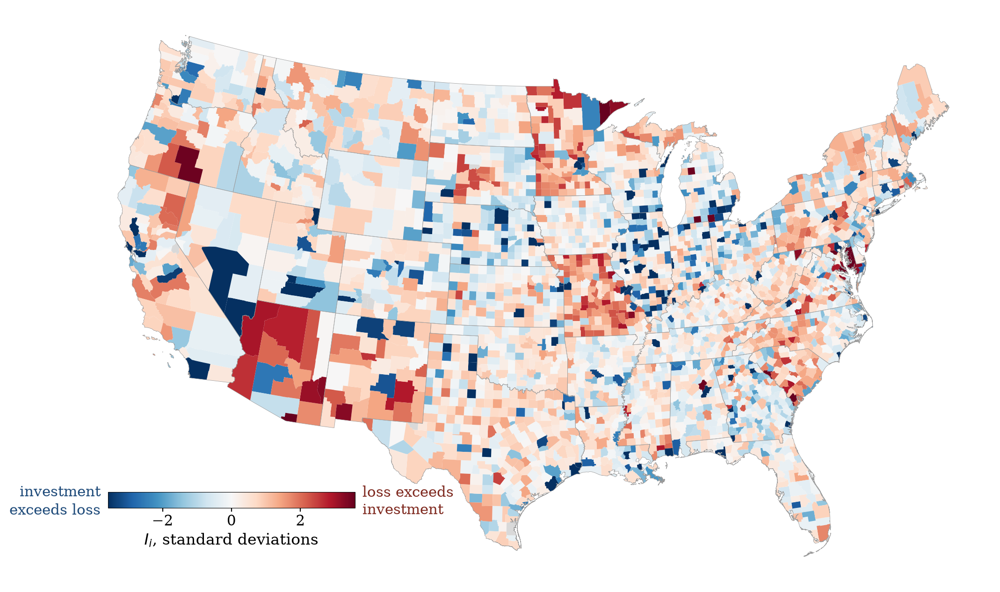
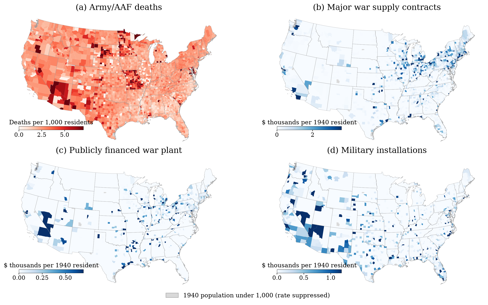

# Unequal Mobilization

**Read the paper: [paper/War_Divergence.pdf](paper/War_Divergence.pdf)** (55 pages)

*Unequal Mobilization: Military Loss, Federal War Investment, and the Geography
of Postwar Development.* A working paper in economic history, and the full
pipeline that produces every number in it.



## The question

One body of research maps where American WWII deaths fell. Another measures what
war spending did to local economies. I put both into one panel of 3,073 U.S.
counties on 1940 boundaries to test whether the places that gave the men got the
money.

They did not. The wartime state made three separate allocations (procurement
contracts, publicly financed plant, and military installations), and all three
followed prewar industrial capacity. Per resident, contract dollars correlate
with the 1940 manufacturing share at 0.69 and with fatal burden at -0.03; plant
and installations behave the same way. In matched comparisons through 1970, a
war plant raised county manufacturing employment by 39 log points, while a
military installation raised total employment by 41 log points, left
manufacturing unmoved, and lowered homeownership by seven and a half points.
With respect to sacrifice, the war state was not hostile but indifferent.



## The data

- 190,693 war supply contracts (the Brunet and Koustas digitization of the
  Civilian Production Administration listing)
- The War Production Board's 1945 facilities report (Garin and Rothbaum's
  digitization)
- 8,293,187 Army enlistment records and the Army/AAF honor lists (ICPSR 38927)
- County outcomes from the Haines census series (ICPSR 2896)

The raw files are not redistributed here; each one is public from its source.
[DATA_LEDGER.md](DATA_LEDGER.md) says where every file comes from, what it
contains, its row counts and the traps in it. The derived results the paper
cites are committed in `data/analysis/*.json`.

## The pipeline

[src/run_all.py](src/run_all.py) runs 35 stages in dependency order: geocoding
the contracts and plants to counties, building the panel, the allocation
correlations, matched plant and installation designs, instrumental-variable
tests, bounds, and then the scripts that write every results table in
`paper/tables/` and both maps.

The last stage, [src/audit_paper_vs_data.py](src/audit_paper_vs_data.py), reads
the LaTeX source and checks the paper's numbers against the files the pipeline
produced. One mismatch fails the whole run. So does a retired number that comes
back, or a table that no script writes. At the final commit it ran 362 checks
with 0 mismatches and covered 85.3 percent of the numeric claims in the body
text. The audit trail is in [docs/AUDIT.md](docs/AUDIT.md) and
[docs/DATA_ANALYSIS_AUDIT.md](docs/DATA_ANALYSIS_AUDIT.md).

## Run it

```bash
python3 -m venv .venv && ./.venv/bin/pip install -r requirements.txt
# put the source files under data/raw/ as laid out in DATA_LEDGER.md, then once:
./.venv/bin/python src/ds2_to_parquet.py
./.venv/bin/python src/run_all.py && git status --short   # must come back empty
cd paper && latexmk War_Divergence.tex
```

Joseph Blumberg · josephblumberg325@gmail.com
